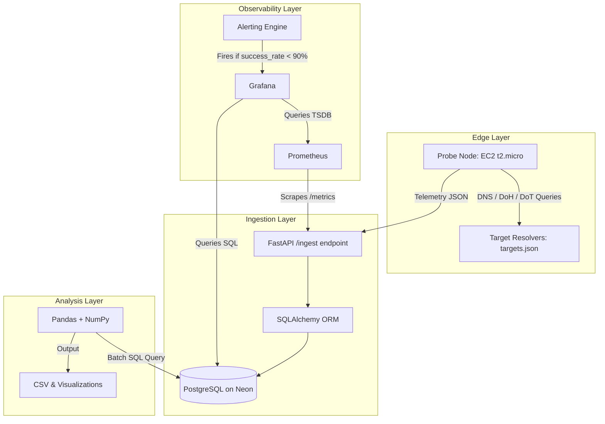
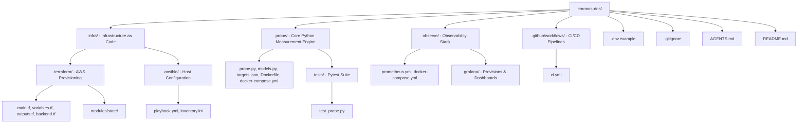

# Chronos-DNS 🌐

> An automated, cloud-native distributed measurement fabric for empirical
> analysis of DNS-over-HTTPS (DoH) and DNS-over-TLS (DoT) deployment,
> latency, and cryptographic compliance across global internet environments.

---

## Research Context

This project is the practical proof-of-concept for my **MEXT Scholarship**
research proposal submitted to the Embassy of Japan in Nepal
(Registration No. 41):

**"Empirical Measurement of DNS Security Protocol Deployment and Its
Relationship to Cloud Infrastructure Reliability in Real-World Internet
Environments"**

### Target Institution
This project is designed to demonstrate research readiness for the
**WIDE Project** (Widely Integrated Distributed Environment) — the
legendary Japanese research consortium that operates the **M Root DNS
Server** and runs the **MAWI Working Group** for internet traffic
measurement and analysis. Affiliated universities include Keio University,
the University of Tokyo, and Tokyo Institute of Technology.

### Research Problem
The global internet is undergoing a critical security transition. Legacy
plaintext DNS (UDP port 53) exposes user queries to surveillance and
manipulation. DNS-over-HTTPS (DoH) and DNS-over-TLS (DoT) encrypt this
traffic — but real-world adoption is uneven, and the performance and
reliability implications of this transition are not well-understood at
scale. Chronos-DNS builds the measurement infrastructure to study this
empirically.

---

## What Chronos-DNS Does

Chronos-DNS deploys lightweight measurement probe nodes across multiple
cloud regions. Each probe periodically fires DNS, DoH, and DoT queries
to a curated list of public resolvers (Cloudflare, Google, Quad9, Mullvad,
and others), capturing:

- Round-trip time (RTT) in milliseconds per protocol
- TLS handshake duration for encrypted resolvers
- Certificate validity and expiry dates
- Query success/failure rates and failure reasons
- Protocol-level anomalies (fallback behaviour, timeout patterns)

All telemetry is ingested into a central PostgreSQL database, visualised
in real-time Grafana dashboards, and stored for longitudinal analysis
using Pandas and NumPy.

---

## Architecture




---

## Live System Metrics

The following metrics are actively collected by the `chronos-dns-probe` service and stored in PostgreSQL (Neon), scraped by Prometheus, and visualized in the Grafana dashboard:

### Grafana Dashboard Visualizations

Here is the live Grafana dashboard showing the global DNS resolver query metrics, including Average RTT, Success Rate, TLS Certificate Expiry, and TLS Handshake Latency:


### Real Resolver Measurements

| Resolver | Protocol | Avg RTT | TLS Handshake | Cert Expiry |
|---|---|---|---|---|
| Cloudflare | DNS | ~155ms | N/A | N/A |
| Cloudflare | DoH | ~200ms | ~11ms | 187 days |
| Cloudflare | DoT | ~45ms | ~11ms | 187 days |
| Google | DNS | ~143ms | N/A | N/A |
| Google | DoH | ~187ms | ~21ms | 61 days |
| Google | DoT | ~15ms | ~8ms | 61 days |
| Quad9 | DoT | N/A | N/A | 40 days |
| AdGuard | DoT | N/A | N/A | 135 days |
| Mullvad | DoT | ~127ms | ~358ms | 64 days |
| CleanBrowsing | DoT | ~125ms | ~65ms | 28 days |

---

## Technical Stack

| Layer | Technology | Version | Purpose |
|---|---|---|---|
| Infrastructure as Code | Terraform | 1.15.6 | Provision AWS EC2, VPC, S3, DynamoDB |
| Configuration management | Ansible | core 2.21.0 | Server hardening, Docker install, Cloudflare tunnel setup |
| Measurement probe | Python | 3.12 | DNS/DoH/DoT query engine |
| DNS library | dnspython | latest | Standard DNS query handling |
| HTTP client | httpx | latest | DoH queries over HTTPS with TLS metrics |
| Data processing | Pandas + NumPy | latest | Telemetry structuring and analysis |
| API framework | FastAPI | latest | Ingest endpoint + /metrics exposure |
| Containerisation | Docker | 29.5.3 | Probe packaging and deployment |
| Container orchestration | Docker Compose | v5.1.4 | Multi-service local and remote deployment |
| Secure networking | Cloudflare Tunnels | 2026.5.2 | Zero open inbound ports on probe nodes |
| CI/CD | GitHub Actions | — | Lint, test, build, push, deploy pipeline |
| Metrics collection | Prometheus | latest | Scrape probe /metrics endpoint |
| Visualisation | Grafana | latest | Real-time dashboards and alerting |
| Database | PostgreSQL on Neon | 15 | Telemetry storage, serverless managed |
| Cloud provider | AWS | — | EC2 compute, ap-south-1 region (Mumbai) |
| State backend | AWS S3 + DynamoDB | — | Terraform remote state with locking |

---

## Repository Structure



---

## DNS Resolvers Under Measurement

| Resolver | Operator | DoH Endpoint | DoT Host |
|---|---|---|---|
| 1.1.1.1 | Cloudflare | `https://cloudflare-dns.com/dns-query` | `one.one.one.one:853` |
| 8.8.8.8 | Google | `https://dns.google/dns-query` | `dns.google:853` |
| 9.9.9.9 | Quad9 | `https://dns.quad9.net/dns-query` | `dns.quad9.net:853` |
| 94.140.14.14 | AdGuard | `https://dns.adguard.com/dns-query` | `dns.adguard.com:853` |
| 194.242.2.2 | Mullvad | `https://doh.mullvad.net/dns-query` | `doh.mullvad.net:853` |
| 185.228.168.9 | CleanBrowsing | `https://doh.cleanbrowsing.org/doh/family-filter` | `family-filter-dns.cleanbrowsing.org:853` |

---

## Metrics Captured Per Query

| Metric | Type | Labels | Description |
|---|---|---|---|
| `probe_rtt_seconds` | Histogram | resolver, protocol | End-to-end query round-trip time |
| `probe_tls_handshake_seconds` | Histogram | resolver | TLS handshake duration (DoH/DoT only) |
| `probe_success_total` | Counter | resolver, protocol | Successful query count |
| `probe_failures_total` | Counter | resolver, protocol, reason | Failed query count with reason |
| `probe_cert_expiry_days` | Gauge | resolver | Days until TLS certificate expires |

---

## CI/CD Pipeline


Every push triggers the full pipeline. A failed test blocks deployment.
Build status and coverage reports appear in the GitHub Actions summary.

---

## Getting Started (Development)

```bash
# Clone
git clone https://github.com/Rabin-Mishra/chronos-dns.git
cd chronos-dns

# Copy and fill environment variables
cp .env.example .env
nano .env

# Install Python dependencies
pip3 install dnspython httpx pandas numpy fastapi uvicorn \
  pytest pytest-asyncio python-dotenv prometheus-client \
  psycopg2-binary sqlalchemy --break-system-packages

# Run the probe locally
cd probe && python3 probe.py

# Run tests
pytest tests/ -v --tb=short

# Start full local stack
docker compose up -d
```

---

## Infrastructure Setup

```bash
# Provision AWS infrastructure
cd infra/terraform
terraform init
terraform plan
terraform apply

# Configure and harden the EC2 node
cd ../ansible
ansible-playbook playbook.yml -i inventory.ini
```

---

## Research Alignment with WIDE Project

The WIDE Project has operated the M Root DNS Server since 1997 and
produces the MAWI dataset — one of the world's longest-running internet
traffic archives. Chronos-DNS is designed as a miniature version of the
kind of measurement infrastructure WIDE operates at scale.

When scaled using WIDE's infrastructure and the MAWI datasets,
Chronos-DNS's methodology can answer:

- What percentage of global DNS traffic is now encrypted?
- Which cloud regions show the highest DoT/DoH adoption?
- Do DNSSEC-signed zones correlate with lower packet loss?
- How does resolver geography affect TLS handshake latency?

---

## Author

**Rabin Mishra**
MEXT Scholarship Applicant — Embassy of Japan in Nepal (No. 41)
Target: WIDE Project, Japan
GitHub: [github.com/Rabin-Mishra](https://github.com/Rabin-Mishra)

---

## Status

| Component | Status |
|---|---|
| Repository scaffold | ✅ Complete |
| Terraform infrastructure | ✅ Complete |
| Python probe engine | ✅ Complete |
| Docker + CI/CD pipeline | ✅ Complete |
| Observability stack | ✅ Complete |
| Ansible hardening | ✅ Complete |
| Grafana dashboards | ✅ Complete |
| Multi-region deployment | ✅ Complete |
| Research analysis notebooks | ✅ Complete |

---

*Built as a research proof-of-concept. Not intended for production use
without further security review.*
