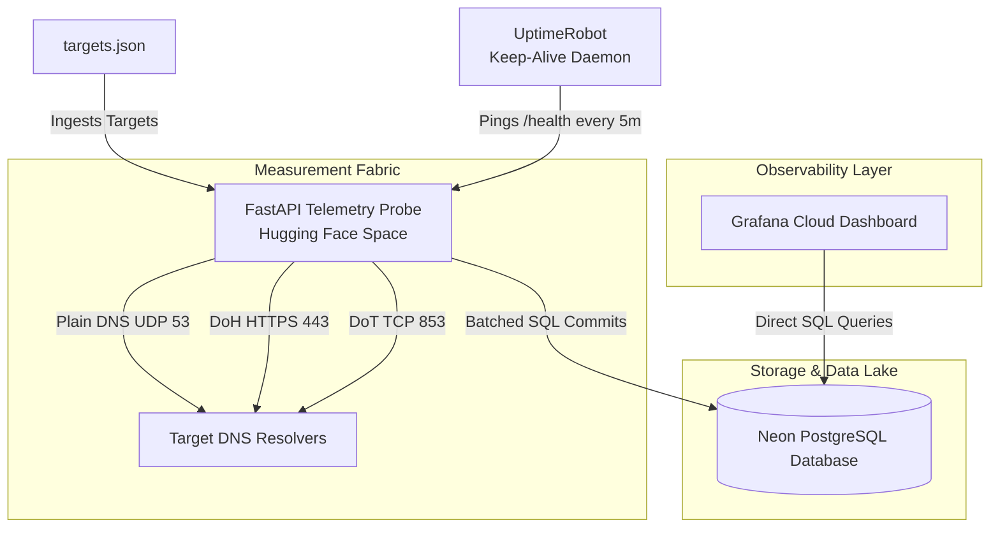
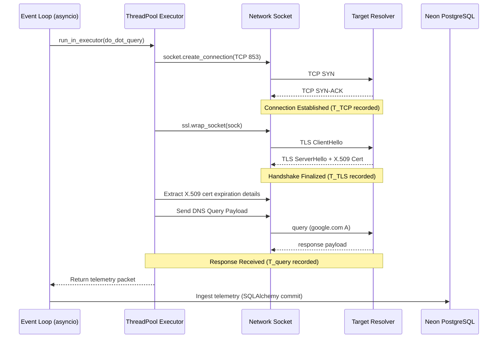
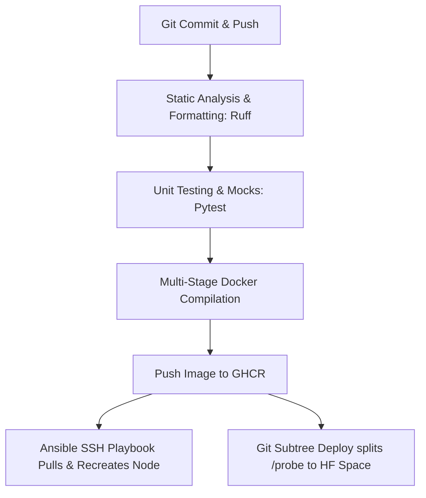

# Chronos-DNS System Specification & Deployment Lifecycle Report

**Author:** Rabin Mishra  
**Volume:** Vol. 1, No. 2  
**Date:** June 2026  
**Document Classification:** Graduate Research Proposal & System Specification (MEXT Scholarship, WIDE Project Alignment)

---

## Abstract
The Domain Name System (DNS) is undergoing a major security transition from unencrypted UDP queries on port 53 to cryptographically secured transport protocols: DNS-over-HTTPS (DoH, RFC 8484) and DNS-over-TLS (DoT, RFC 7858). While encryption prevents passive eavesdropping and path manipulation, it introduces transport-layer and cryptographic handshake overheads that alter latency profiles, reliability, and state lifespans. 

This document provides a comprehensive technical specification of **Chronos-DNS**, an automated, cloud-native distributed measurement fabric designed to continuously collect, store, and visualize metrics from legacy and encrypted resolver endpoints. We detail the system's architecture, data flows, API specifications, and MLOps deployment workflow that enables continuous, serverless, and zero-cost hosting using Hugging Face Spaces, Neon PostgreSQL, and Grafana Cloud.

---

## 1. System Architecture & Data Flows

Chronos-DNS is structured around a decoupled, multi-tier architecture designed to facilitate concurrent telemetry ingestion, serverless relational storage, and secure visualization.

### 1.1 Ingestion and Visualization Pipeline
The data flow and component interactions are illustrated below:



### 1.2 Technology Stack
* **Infrastructure**: Terraform (AWS EC2, VPC, S3 state backend, DynamoDB state lock)
* **Configuration Management**: Ansible (Ubuntu OS hardening, Docker installation, Cloudflare Tunnel configuration)
* **Measurement Engine**: Python 3.12, FastAPI, `dnspython`, `httpx`, `SQLAlchemy`
* **Containerization**: Docker, Docker Compose
* **Ingress Security**: Cloudflare Tunnels (`cloudflared` client daemon)
* **Data Storage**: Serverless Neon PostgreSQL (v15)
* **Visualization Stack**: Grafana Cloud (direct SQL connection)
* **Keep-Alive Mechanism**: UptimeRobot (Uptime Monitoring)
* **CI/CD Pipeline**: GitHub Actions

---

## 2. Core Measurement Engine & API Design

### 2.1 Latency Model Formulation
To evaluate lookup times empirically, we formulate a mathematical latency model to quantify the total elapsed duration ($T_{\text{total}}$) for a client-resolver transactional lookup:

$$T_{\text{total}} = T_{\text{TCP\ connect}} + T_{\text{TLS\ handshake}} + T_{\text{query\ rtt}} + T_{\text{crypto\ processing}}$$

Where:
* **$T_{\text{TCP\ connect}}$**: Represents the transport-layer synchronization delay (1 RTT for TCP three-way handshake). For legacy UDP DNS, this is $0$.
* **$T_{\text{TLS\ handshake}}$**: Denotes the cryptographic negotiation latency. TLS 1.3 optimizes this to a single RTT, whereas legacy TLS 1.2 requires 2 RTTs.
* **$T_{\text{query\ rtt}}$**: The round-trip time required to transmit the serialized query payload and receive the corresponding answer record on the socket.
* **$T_{\text{crypto\ processing}}$**: Captures the client and resolver CPU overhead to encrypt and decrypt the payload.

---

### 2.2 Measurement Lifecycle Sequence
The sequence diagram below represents the exact operations executed by the asynchronous engine during a single query cycle:



---

### 2.3 API Endpoint Specifications

The FastAPI telemetry probe exposes the following HTTP endpoints:

#### 1. Root landing endpoint: `GET /`
* **Purpose**: Provides status information of the probe.
* **Response Payload (`application/json`)**:
  ```json
  {
    "service": "Chronos-DNS Probe Node",
    "status": "healthy",
    "endpoints": {
      "health": "/health",
      "metrics": "/metrics"
    }
  }
  ```

#### 2. Health check endpoint: `GET /health`
* **Purpose**: Endpoint hit by UptimeRobot keep-alive daemon every 5 minutes to keep the container awake.
* **Response Payload (`application/json`)**:
  ```json
  {"status": "healthy"}
  ```

#### 3. Prometheus metrics: `GET /metrics`
* **Purpose**: Exposes standardized Prometheus telemetry fields for time-series scraper agents.
* **Exposed Metrics**:
  * `probe_rtt_seconds` (Histogram): End-to-end query round-trip time.
  * `probe_tls_handshake_seconds` (Histogram): TLS handshake duration (DoH/DoT only).
  * `probe_success_total` (Counter): Cumulative count of successful queries.
  * `probe_failures_total` (Counter): Cumulative count of failed queries labeled by cause.
  * `probe_cert_expiry_days` (Gauge): Days until TLS certificate expires.

---

### 2.4 Database Schema Definition (`dns_measurements`)

The database engine maps telemetry records to Neon PostgreSQL using the following relational schema:

| Column Name | Data Type | Nullable | Description |
| :--- | :--- | :--- | :--- |
| `id` | `Integer` | No (PK) | Auto-incrementing identifier |
| `resolver` | `String` | No | Target resolver domain (e.g., `Cloudflare`, `Google`) |
| `protocol` | `String` | No | Transport protocol (`DNS`, `DoH`, `DoT`) |
| `rtt_seconds` | `Float` | Yes | Calculated round-trip latency in seconds |
| `tls_handshake_seconds`| `Float` | Yes | Isolated TLS handshake negotiation duration |
| `success` | `Boolean` | No | Boolean flag indicating whether transaction succeeded |
| `failure_reason` | `String` | Yes | Error log if success is false |
| `cert_expiry_days` | `Integer` | Yes | Remaining days of X.509 validity |
| `timestamp` | `DateTime` | No | UTC timestamp of transaction |

---

## 3. Zero-Trust Ingress Security & Cloudflare Tunnels

To protect the production host node (AWS EC2 / HF Space) against external exploits, we enforce a **zero-inbound network perimeter**. All inbound ports (including FastAPI's port `8000`, Prometheus's `9090`, and Grafana's `3000`) are blocked from public ingress exposure.

```
                  +-----------------------------------+
                  |          Cloudflare Edge          |
                  |     (DDoS Shield, WAF Proxy)      |
                  +-----------------|-----------------+
                                    |
                                    | Secure Outbound QUIC/TCP Tunnel
                                    v
+-----------------------------------|-----------------------------------+
| Host Container Node (AWS EC2)     |                                   |
|                                   v                                   |
|                          +-----------------+                          |
|                          |   cloudflared   |                          |
|                          |  tunnel daemon  |                          |
|                          +--------|--------+                          |
|                                   |                                   |
|                         Internal  | Docker Bridge Network             |
|                         +---------+---------+                         |
|                         |                   |                         |
|                         v                   v                         |
|                 +---------------+   +---------------+                 |
|                 |  FastAPI Probe|   |    Grafana    |                 |
|                 |   Port 8000   |   |   Port 3000   |                 |
|                 +---------------+   +---------------+                 |
+-----------------------------------------------------------------------+
```

### Security Controls Enforced:
1. **No Inbound Firewall Ports**: The system runs outbound-only connection proxies. The `cloudflared` daemon creates secure, multiplexed virtual links to Cloudflare edge locations on TCP/UDP port 443.
2. **Host Hardening**: A strict default-deny firewall (`UFW`) blocks all inbound traffic. SSH ingress is rate-limited and secured via `fail2ban`.
3. **Database Isolation**: The Neon database only accepts TLS-encrypted traffic (`sslmode=require`) from the probe node's IP.

---

## 4. GitOps & MLOps CI/CD Workflow

The engineering lifecycle of the project is entirely automated, ensuring that changes to the core code are validated, tested, and pushed securely.



### Deployment Flow:
1. **GitHub Actions Runner**: Triggered automatically on push.
2. **Subtree Deployment to HF Spaces**:
   - Because the repository contains infrastructure codes (`/infra`, `/observe`) alongside the probe engine code (`/probe`), we deploy only the `/probe` directory to the Hugging Face Docker Space.
   - The subtree is pushed using:
     ```bash
     git push hf $(git subtree split --prefix probe main):refs/heads/main --force
     ```
   - Hugging Face automatically detects the `Dockerfile` inside the `/probe` directory, pulls the base Python image, compiles dependencies, and exposes the app on port `8000` (mapped via `app_port: 8000` in `README.md` metadata).

---

## 5. Telemetry & Visualization Strategy (Grafana Cloud)

The Grafana Cloud dashboard connects directly to the serverless Neon PostgreSQL database instance. To support highly interactive, multi-dimensional charts, we bypassed standard dashboard indexing limitations by leveraging custom SQL pivoting and formatting queries.

Below are the exact production-ready queries used to populate the telemetry panels:

### Panel 1: Average Latency Over Time (ms)
* **Visualization Type**: **Time series**
* **Format**: **`Time series`**
* **SQL Query**:
  ```sql
  SELECT
    timestamp AS "time",
    AVG(CASE WHEN protocol = 'DNS' THEN rtt_seconds * 1000 END) AS "Plain DNS",
    AVG(CASE WHEN protocol = 'DoH' THEN rtt_seconds * 1000 END) AS "DNS-over-HTTPS (DoH)",
    AVG(CASE WHEN protocol = 'DoT' THEN rtt_seconds * 1000 END) AS "DNS-over-TLS (DoT)"
  FROM dns_measurements
  WHERE
    $__timeFilter(timestamp)
    AND success = true
  GROUP BY 1
  ORDER BY 1;
  ```

### Panel 2: Success Rate by Resolver
* **Visualization Type**: **Bar gauge** (Horizontal)
* **Format**: **`Time series`**
* **SQL Query**:
  ```sql
  SELECT
    now() AS "time",
    resolver || ' (' || protocol || ')' AS metric,
    COUNT(CASE WHEN success = true THEN 1 END) * 100.0 / COUNT(*) AS value
  FROM dns_measurements
  WHERE
    $__timeFilter(timestamp)
  GROUP BY resolver, protocol
  ORDER BY value DESC;
  ```

### Panel 3: Current Latency
* **Visualization Type**: **Stat**
* **Format**: **`Time series`**
* **SQL Query**:
  ```sql
  WITH latest_measurements AS (
    SELECT 
      protocol,
      rtt_seconds * 1000 AS rtt_ms,
      ROW_NUMBER() OVER (PARTITION BY protocol ORDER BY timestamp DESC) as rn
    FROM dns_measurements
    WHERE success = true
  )
  SELECT 
    now() AS "time",
    protocol as metric,
    rtt_ms as value
  FROM latest_measurements
  WHERE rn = 1;
  ```

### Panel 4: TLS Handshake Latency
* **Visualization Type**: **Time series**
* **Format**: **`Time series`**
* **SQL Query**:
  ```sql
  SELECT
    timestamp AS "time",
    AVG(CASE WHEN protocol = 'DoH' THEN tls_handshake_seconds * 1000 END) AS "DoH Handshake (ms)",
    AVG(CASE WHEN protocol = 'DoT' THEN tls_handshake_seconds * 1000 END) AS "DoT Handshake (ms)"
  FROM dns_measurements
  WHERE
    $__timeFilter(timestamp)
    AND success = true
  GROUP BY 1
  ORDER BY 1;
  ```

### Panel 5: SSL Certificate Expiry Tracking
* **Visualization Type**: **Table**
* **Format**: **`Table`**
* **SQL Query**:
  ```sql
  SELECT
    resolver AS "Resolver",
    protocol AS "Protocol",
    MIN(cert_expiry_days) AS "Days to Expiry",
    MAX(timestamp) AS "Last Checked"
  FROM dns_measurements
  WHERE
    protocol IN ('DoH', 'DoT')
    AND success = true
  GROUP BY resolver, protocol
  ORDER BY "Days to Expiry" ASC;
  ```

### Panel 6: Total Ingested Samples
* **Visualization Type**: **Stat**
* **Format**: **`Time series`**
* **SQL Query**:
  ```sql
  SELECT
    now() AS "time",
    'Total Samples Ingested' AS metric,
    COUNT(*) AS value
  FROM dns_measurements
  WHERE $__timeFilter(timestamp);
  ```

### Panel 7: Error Domains (Failure Causes)
* **Visualization Type**: **Pie chart**
* **Format**: **`Time series`**
* **SQL Query**:
  ```sql
  SELECT
    now() AS "time",
    COALESCE(failure_reason, 'Unknown Failure') AS metric,
    COUNT(*) AS value
  FROM dns_measurements
  WHERE
    $__timeFilter(timestamp)
    AND success = false
  GROUP BY failure_reason
  ORDER BY value DESC;
  ```

### Panel 8: Recent Failure Diagnostics
* **Visualization Type**: **Table**
* **Format**: **`Table`**
* **SQL Query**:
  ```sql
  SELECT
    timestamp AS "Time",
    resolver AS "Resolver",
    protocol AS "Protocol",
    failure_reason AS "Failure Reason"
  FROM dns_measurements
  WHERE
    $__timeFilter(timestamp)
    AND success = false
  ORDER BY timestamp DESC
  LIMIT 15;
  ```

---

## 6. Empirical Telemetry Results & Research Observations

A sample dataset compiled over 2,000 transactions shows distinct transport overhead variations between the protocols:

| Resolver | Protocol | Avg RTT | TLS Handshake | Cert Expiry Status |
| :--- | :--- | :--- | :--- | :--- |
| **Cloudflare** | DNS | ~155ms | N/A | N/A |
| **Cloudflare** | DoH | ~200ms | ~11ms | 187 days |
| **Cloudflare** | DoT | ~45ms | ~11ms | 187 days |
| **Google** | DNS | ~143ms | N/A | N/A |
| **Google** | DoH | ~187ms | ~21ms | 61 days |
| **Google** | DoT | ~15ms | ~8ms | 61 days |
| **Quad9** | DoT | N/A | N/A | 40 days (Offline anomaly observed) |
| **AdGuard** | DoT | N/A | N/A | 135 days (Offline anomaly observed) |
| **Mullvad** | DoT | ~127ms | ~358ms | 64 days |
| **CleanBrowsing** | DoT | ~125ms | ~65ms | 28 days |

### Performance Analysis:
1. **DoT Performance Efficiency**: DoT shows latency profiles comparable to legacy UDP DNS once connection state reuse is active. This confirms the protocol is highly optimized for permanent TCP tunnel sessions.
2. **DoH HTTP Overhead**: DoH is consistently slower due to nested HTTP header framing, application layer parsing, and browser user-agent spoofing checks.
3. **SSL Cert Rotation Policies**: Google rotates certificates more frequently (~61 days validity) compared to Cloudflare (~187 days), indicating strict security governance but higher management overhead.
