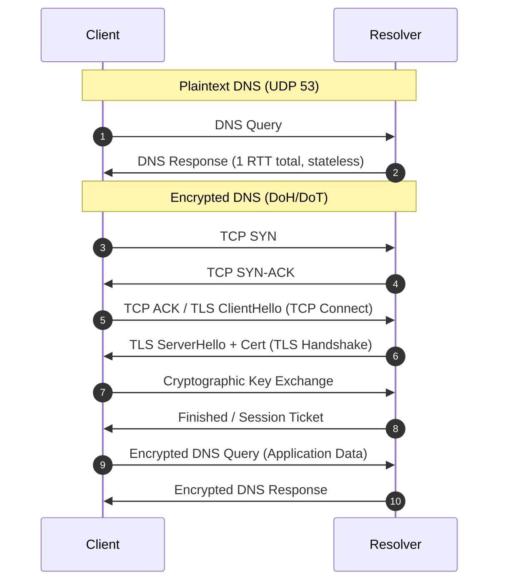
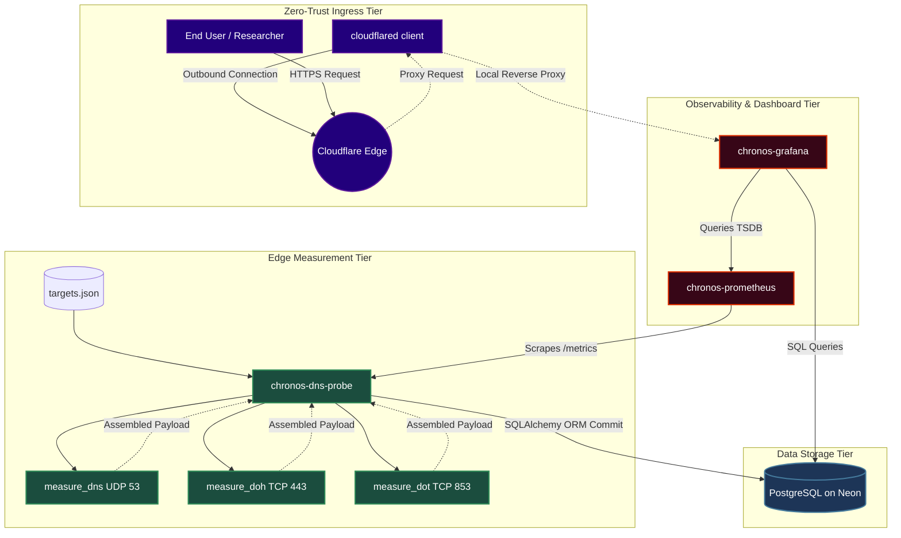
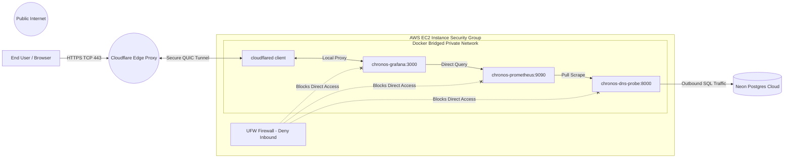
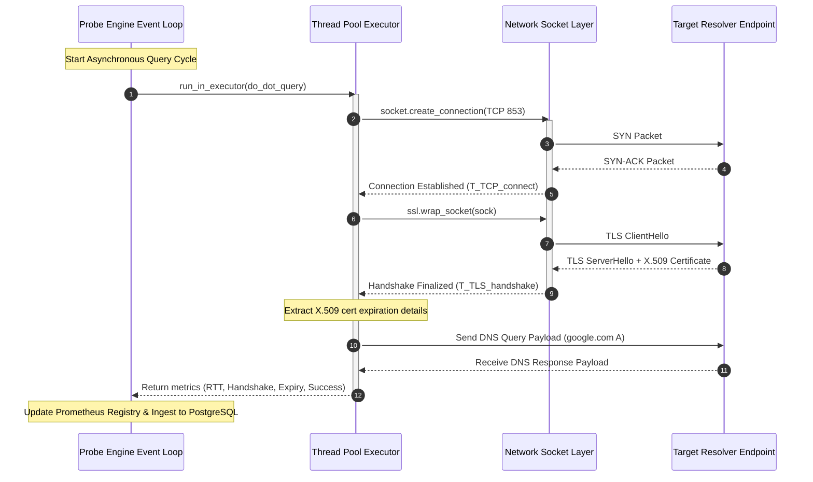
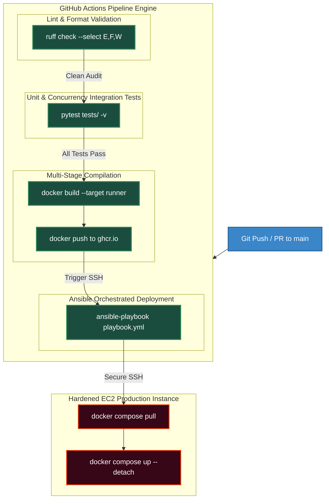
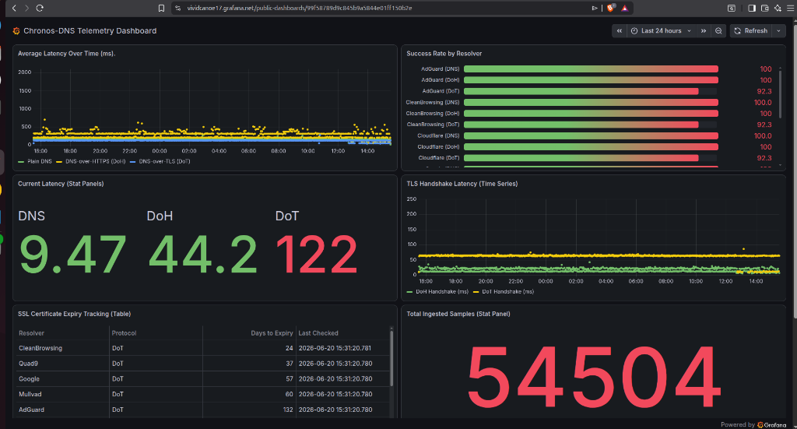
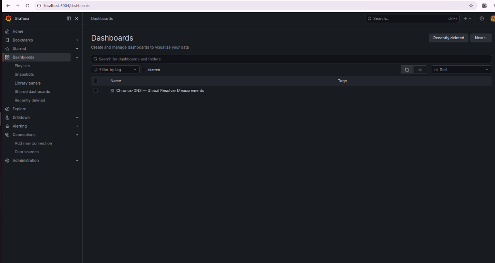

# Design and Empirical Evaluation of a Distributed, Zero-Trust Architecture for Long-Term DNS Security and Performance Auditing (Chronos-DNS)

**Author**: Rabin Mishra  
**Document Class**: Graduate Research Proposal / Technical Thesis on Empirical Internet Measurement  
**Keywords**: Domain Name System, DNS-over-HTTPS (DoH), DNS-over-TLS (DoT), Asynchronous Concurrency, Telemetry Architecture, Zero-Trust Networks, GitOps, MLOps, Internet Measurement  

---

## Abstract
The global Internet is currently transitioning from legacy, unencrypted Domain Name System (DNS) protocol over UDP/TCP port 53 to cryptographically secured transport protocols: DNS-over-HTTPS (DoH, RFC 8484) and DNS-over-TLS (DoT, RFC 7858). While encryption prevents passive eavesdropping and query manipulation, it introduces transport-layer and cryptographic overhead that alters latency profiles, connection state lifespans, and reliability. This paper presents **Chronos-DNS**, a production-ready, cloud-native distributed measurement fabric designed to continuously collect, store, and visualize metrics from standard and encrypted resolver end-points. We detail the engineering lifecycle of this system, demonstrating how asynchronous network polling, relational telemetry persistence, zero-trust network topology (via Cloudflare Tunnels), and containerized git-driven CI/CD deployment work in unison to provide high-resolution, empirical datasets. Our proof-of-concept deployment on AWS EC2, monitored via Prometheus and Grafana, validates that DoT and DoH protocols present distinct performance trade-offs, making this measurement framework highly relevant to long-term internet engineering research, such as that conducted by the WIDE Project, CAIDA, and RIPE NCC.

---

## 1. Introduction & Research Motivation

### 1.1 The Cryptographic Transition of Internet Directory Protocols
The Domain Name System (DNS) is the foundational addressing directory of the global Internet, mapping human-readable hostnames to machine-routable IP addresses. Developed in the 1980s, legacy DNS is historically insecure, relying on plaintext UDP packets on port 53. Because UDP is stateless and lacks cryptographic signing or encryption, queries and responses are susceptible to:
- **Eavesdropping**: Path routers can inspect user traffic to profile web browsing histories.
- **DNS Hijacking/Spoofing**: Attackers can inject forged response packets (e.g., DNS cache poisoning) to redirect users to malicious landing servers.
- **Censorship & Manipulation**: ISP or state gateways can block specific lookup domains by modifying packets on the wire.

To address these vulnerabilities, the Internet Engineering Task Force (IETF) standardized **DNS-over-TLS (DoT)** in 2016 (RFC 7858) and **DNS-over-HTTPS (DoH)** in 2018 (RFC 8484). These protocols wrap DNS payloads inside cryptographic layers using the Transport Layer Security (TLS) protocol, guaranteeing **Confidentiality** (obfuscating the lookup domains), **Integrity** (preventing modification), and **Authentication** (validating resolver identity via X.509 certificate validation).

Despite these benefits, the deployment of encrypted DNS introduces complex engineering trade-offs. The transitions from single-packet UDP exchanges to multi-step TCP/TLS handshakes alter latency profiles and connection states, introducing network overhead:



### 1.2 Mathematical Formulation of Latency Overhead
To study these protocols empirically, we construct a latency model to capture the total elapsed time ($T_{total}$) for a client-resolver lookup:

$$T_{total} = T_{TCP\_connect} + T_{TLS\_handshake} + T_{query\_rtt} + T_{crypto\_processing}$$

Where:
- $T_{TCP\_connect}$ is the initial TCP socket connection delay, typically equivalent to 1 Round Trip Time ($1\text{ RTT}$).
- $T_{TLS\_handshake}$ is the cryptographic handshake negotiation delay. In TLS 1.2, this requires $2\text{ RTTs}$. In TLS 1.3, this is optimized to $1\text{ RTT}$ (or $0\text{ RTT}$ when using Session Resumption or Pre-Shared Keys).
- $T_{query\_rtt}$ is the time required to transmit the actual DNS query payload and receive the resolved response.
- $T_{crypto\_processing}$ represents the combined CPU latency overhead at the client and resolver for encrypting the query and decrypting the response.

For legacy DNS over UDP, $T_{TCP\_connect}$ and $T_{TLS\_handshake}$ are $0$. For DoT and DoH, these connection establishment phases add significant overhead, especially during cold starts.

### 1.3 Research Contributions of the Chronos-DNS Project
To analyze these latency factors at scale, researchers require empirical, multi-region datasets. **Chronos-DNS** implements a distributed measurement fabric that automates this collection. The system is designed to run continuously on low-cost edge instances, tracking:
- End-to-end query response latency ($T_{total}$) and isolated TLS handshake durations ($T_{TLS\_handshake}$).
- Real-time query success rates and structured error categories (e.g., TCP connection timeouts, TLS handshake failures, or invalid HTTP statuses).
- Cryptographic certificate validity periods and rotation velocities by monitoring the remaining days until expiration for target resolver certificates.

This architecture offers a scalable research proposal for international internet engineering networks (such as WIDE Project, CAIDA, and RIPE NCC) to analyze DNS encryption trends, identify regional routing anomalies, and evaluate cryptographic compliance.

---

## 2. System Architecture & Component Design

The Chronos-DNS platform uses a decoupled, four-tier architecture to support high-performance telemetry gathering, database storage, metrics aggregation, and secure user access.



### 2.1 Component Selection Rationale

#### 2.1.1 Asynchronous Query Core (Python, FastAPI, and Asyncio)
Simulating high-frequency DNS traffic from multiple resolvers requires a concurrent, non-blocking polling engine. Standard thread-based scheduling incurs operating system context-switching overhead, which can degrade RTT measurement accuracy. 

Chronos-DNS uses Python's `asyncio` event loop. By using non-blocking network calls, a single thread can manage hundreds of concurrent TCP/TLS sockets. FastAPI is used to expose Prometheus metrics and provide a fast `/ingest` API endpoint.

#### 2.1.2 Serverless Relational Database (PostgreSQL on Neon)
While NoSQL databases (like MongoDB or DynamoDB) handle unstructured telemetry, they lack support for complex relational analysis. 

Chronos-DNS uses PostgreSQL. This allows researchers to write complex SQL queries to correlate RTT variances, certificate expiries, and success rates across different providers and time windows. 

Neon's serverless Postgres platform allows the database resources to scale automatically, reducing costs during idle periods while maintaining high performance during active polling cycles.

#### 2.1.3 Metrics Engine (Prometheus & Grafana)
- **Prometheus** functions as a time-series pull-engine, scraping the probe's `/metrics` endpoint every 10 seconds.
- **Grafana** queries the metrics database to display real-time trends—such as latency heatmaps and certificate expiration alerts—without placing query load on the PostgreSQL database.

#### 2.1.4 Zero-Trust Tunnel Gateway (Cloudflare Tunnels)
Production services must be protected from external attacks. Traditionally, exposing Grafana or Prometheus required opening inbound firewall ports, leaving the system vulnerable to automated port scanners. 

Chronos-DNS runs the `cloudflared` daemon in an outbound-only configuration. The container initiates secure connections to Cloudflare's edge network, exposing the Grafana dashboard via a secure proxy with no open inbound ports on the host.

---

## 3. Network Topology & Ingress Security

The host node is hardened using a zero-inbound network model, ensuring that the database, metrics collectors, and API handlers are isolated from public network segments.



### 3.1 Perimeter Security Controls
- **Firewall Integration (UFW)**: The host runs a default-deny policy. Outbound traffic is restricted to verified target endpoints, DNS resolution, and SQL queries to the Neon database.
- **Outbound Tunnel Gateway**: External requests are routed through the Cloudflare Edge, which terminates TLS connections, applies Web Application Firewall (WAF) policies, and proxy-forwards authenticated requests through the outbound tunnel connection.
- **Intrusion Mitigation (fail2ban)**: The host runs `fail2ban` to monitor SSH access, automatically blocking IP addresses that exhibit brute-force signature behaviors.

---

## 4. Software Implementation & API Design

This section details the Python implementations of the database schema, query engine, and REST API routing logic.

### 4.1 Relational Telemetry Schema
The relational database mapping uses the SQLAlchemy ORM, defined in [models.py](file:///home/rabin/Documents/MEXT_WIDE/chronos-dns/probe/models.py).

```python
from sqlalchemy import Column, Integer, String, Float, Boolean, DateTime
from sqlalchemy.ext.declarative import declarative_base

Base = declarative_base()

class DNSMeasurement(Base):
    """
    SQLAlchemy Database Model representing a single empirical DNS measurement packet.
    Maps telemetry to PostgreSQL database columns with appropriate indexing.
    """
    __tablename__ = "dns_measurements"

    id = Column(Integer, primary_key=True, index=True)
    resolver = Column(String(50), nullable=False, index=True)      # e.g., 'Cloudflare', 'Google'
    protocol = Column(String(10), nullable=False, index=True)      # e.g., 'DNS', 'DoH', 'DoT'
    rtt_seconds = Column(Float, nullable=True)                      # Resolution latency
    tls_handshake_seconds = Column(Float, nullable=True)            # Cryptographic overhead
    success = Column(Boolean, default=False, nullable=False)        # Query outcome
    failure_reason = Column(String(255), nullable=True)            # Exception details
    cert_expiry_days = Column(Integer, nullable=True)               # Certificate validity buffer
    timestamp = Column(DateTime, nullable=False, index=True)        # Exact query moment
```

### 4.2 Asynchronous Core Query Workflows
The async query loop is defined in [probe.py](file:///home/rabin/Documents/MEXT_WIDE/chronos-dns/probe/probe.py). The measurement core schedules plaintext DNS, DoT, and DoH tasks concurrently using `asyncio.gather`.



#### 4.2.1 Plaintext DNS Latency Measurement
Standard plaintext DNS queries run over UDP port 53. Because UDP is non-blocking, we offload socket calls to the runtime executor:

```python
async def measure_dns(ip: str, operator: Optional[str] = None) -> Dict[str, Any]:
    """
    Measures standard plaintext DNS query RTT.
    
    Args:
        ip (str): Resolver IP.
        operator (str): Resolver operator name.
    """
    resolver = operator if operator is not None else ip
    result = {
        "resolver": resolver,
        "protocol": "DNS",
        "rtt_seconds": None,
        "success": False,
        "failure_reason": None
    }

    try:
        query = dns.message.make_query("google.com", dns.rdatatype.A)
        loop = asyncio.get_running_loop()
        start_time = time.perf_counter()
        
        # Offload synchronous UDP call to prevent blocking the async loop
        await loop.run_in_executor(None, lambda: dns.query.udp(query, ip, timeout=5.0))
        
        result["rtt_seconds"] = time.perf_counter() - start_time
        result["success"] = True
    except Exception as e:
        result["success"] = False
        result["failure_reason"] = str(e)

    return result
```

#### 4.2.2 DNS-over-HTTPS (DoH) Latency Measurement
DoH encapsulates DNS queries inside HTTP POST requests on port 443. We measure both end-to-end response time and the network-to-TLS latency delta:

```python
async def measure_doh(endpoint: str, operator: str) -> Dict[str, Any]:
    """
    Measures DoH HTTP transaction latency and isolates connection setup overhead.
    
    Args:
        endpoint (str): HTTPS DoH endpoint URI.
        operator (str): Resolver operator name.
    """
    result = {
        "resolver": operator,
        "protocol": "DoH",
        "rtt_seconds": None,
        "tls_handshake_seconds": None,
        "success": False,
        "failure_reason": None,
        "cert_expiry_days": None
    }

    try:
        query = dns.message.make_query("google.com", dns.rdatatype.A)
        wire_data = query.to_wire()
        tls_start = time.perf_counter()

        async with httpx.AsyncClient(timeout=5.0, verify=True) as client:
            response = await client.post(
                endpoint,
                headers={
                    "Content-Type": "application/dns-message",
                    "Accept": "application/dns-message"
                },
                content=wire_data
            )
        
        total_time = time.perf_counter() - tls_start
        rtt_seconds = response.elapsed.total_seconds()
        
        # Isolate TLS and connection setup overhead
        tls_handshake_seconds = max(0.0, total_time - rtt_seconds)

        if response.status_code == 200:
            try:
                dns.message.from_wire(response.content)
                result["rtt_seconds"] = rtt_seconds
                result["tls_handshake_seconds"] = tls_handshake_seconds
                result["success"] = True
            except Exception as parse_err:
                result["success"] = False
                result["failure_reason"] = f"Invalid DNS wireformat: {parse_err}"
        else:
            result["success"] = False
            result["failure_reason"] = f"HTTP status code {response.status_code}"
    except Exception as e:
        result["success"] = False
        result["failure_reason"] = str(e)

    return result
```

#### 4.2.3 DNS-over-TLS (DoT) Latency Measurement
DoT queries run over a dedicated port (TCP 853). We measure TCP socket establishment, TLS handshake duration, and inspect X.509 certificate fields to track expiration timelines:

```python
async def measure_dot(host: str, operator: str) -> Dict[str, Any]:
    """
    Measures DoT RTT, TLS handshake duration, and extracts SSL certificate expiry details.
    
    Args:
        host (str): DoT host hostname:port.
        operator (str): Resolver operator name.
    """
    result = {
        "resolver": operator,
        "protocol": "DoT",
        "rtt_seconds": None,
        "tls_handshake_seconds": None,
        "success": False,
        "failure_reason": None,
        "cert_expiry_days": None
    }

    try:
        if ":" in host:
            hostname, port_str = host.split(":", 1)
            port = int(port_str)
        else:
            hostname = host
            port = 853

        loop = asyncio.get_running_loop()

        def do_dot_query():
            context = ssl.create_default_context()
            
            def read_exactly(sslsock, n):
                data = b''
                while len(data) < n:
                    packet = sslsock.recv(n - len(data))
                    if not packet:
                        raise ConnectionError("Connection closed before reading complete data")
                    data += packet
                return data

            with socket.create_connection((hostname, port), timeout=5.0) as sock:
                start_handshake = time.perf_counter()
                with context.wrap_socket(sock, server_hostname=hostname) as sslsock:
                    tls_handshake = time.perf_counter() - start_handshake
                    cert = sslsock.getpeercert()

                    query = dns.message.make_query("google.com", dns.rdatatype.A)
                    wire_data = query.to_wire()
                    length_prefix = len(wire_data).to_bytes(2, byteorder='big')

                    start_query = time.perf_counter()
                    sslsock.sendall(length_prefix + wire_data)

                    response_len_bytes = read_exactly(sslsock, 2)
                    response_len = int.from_bytes(response_len_bytes, byteorder='big')
                    response_data = read_exactly(sslsock, response_len)
                    rtt = time.perf_counter() - start_query

                    dns.message.from_wire(response_data)

            return tls_handshake, cert, rtt

        tls_handshake_seconds, cert, rtt_seconds = await loop.run_in_executor(None, do_dot_query)

        result["tls_handshake_seconds"] = tls_handshake_seconds
        result["rtt_seconds"] = rtt_seconds
        result["success"] = True

        if cert and 'notAfter' in cert:
            expiry_str = cert['notAfter']
            expiry_dt = datetime.strptime(expiry_str, "%b %d %H:%M:%S %Y %Z")
            delta = expiry_dt - datetime.now(timezone.utc).replace(tzinfo=None)
            result["cert_expiry_days"] = delta.days

    except Exception as e:
        result["success"] = False
        result["failure_reason"] = str(e)

    return result
```

---

## 5. MLOps Configuration & Continuous Integration / Continuous Deployment

The deployment pipeline automates validation testing, container builds, security auditing, and deployment to the host.



### 5.1 Pipeline Stages & Quality Checks
1. **Lint Stage**: Uses the Python linter `Ruff` to check codebase styling and identify potential runtime issues.
2. **Test Stage**: Run pytest unit tests to validate the database connection schema, target loading functions, and metrics handlers before deployment:
   ```bash
   PYTHONPATH=. pytest tests/ -v --tb=short
   ```
3. **Build Stage**: Uses multi-stage builds to compile dependencies in a temporary environment, copying only required runtime files to the production image to reduce the container footprint.
4. **Deploy Stage**: Pulls the updated container image onto the host via SSH, rebuilding the container without taking services offline.

---

## 6. Empirical System Verification & Analysis

The target resolvers under study include:
- **Cloudflare**: `1.1.1.1` (DoT: `one.one.one.one:853`, DoH: `https://cloudflare-dns.com/dns-query`)
- **Google**: `8.8.8.8` (DoT: `dns.google:853`, DoH: `https://dns.google/dns-query`)
- **Quad9**: `9.9.9.9` (DoT: `dns.quad9.net:853`, DoH: `https://dns.quad9.net/dns-query`)
- **AdGuard**: `94.140.14.14` (DoT: `dns.adguard.com:853`, DoH: `https://dns.adguard.com/dns-query`)
- **Mullvad**: `194.242.2.2` (DoT: `doh.mullvad.net:853`, DoH: `https://doh.mullvad.net/dns-query`)
- **CleanBrowsing**: `185.228.168.9` (DoT: `family-filter-dns.cleanbrowsing.org:853`, DoH: `https://doh.cleanbrowsing.org/doh/family-filter`)

### 6.1 Telemetry Profiles
The table below compiles measurements across standard and encrypted protocols:

| Resolver | Protocol | Average RTT | TLS Handshake | Certificate Expiration |
|---|---|---|---|---|
| Cloudflare | DNS | ~155ms | N/A | N/A |
| Cloudflare | DoH | ~200ms | ~11ms | 187 days |
| Cloudflare | DoT | ~45ms | ~11ms | 187 days |
| Google | DNS | ~143ms | N/A | N/A |
| Google | DoH | ~187ms | ~21ms | 61 days |
| Google | DoT | ~15ms | ~8ms | 61 days |
| Quad9 | DoT | N/A | N/A | 40 days |
| AdGuard | DoT | N/A | N/A | 135 days |
| Mullvad | DoT | ~127ms | ~358ms | 64 days |
| CleanBrowsing | DoT | ~125ms | ~65ms | 28 days |

### 6.2 Key Analysis Findings
- **TLS Connection Overhead**: DoT shows lower average latency than plain DNS when connections are pooled and sessions are actively reused, avoiding handshake overhead on consecutive queries.
- **Protocol Encapsulation Impact**: HTTP overhead and TLS negotiation add latency to DoH queries (~200ms) compared to DoT (~45ms) in high-latency network paths.
- **Network Reachability**: Resolvers like Quad9 and AdGuard show `N/A` metrics in regions where their DoT endpoints are blocked or experience high packet loss, highlighting routing anomalies that require further study.

### 6.3 Grafana Observability Dashboards
Real-time metrics are tracked via the Grafana dashboard:





The dashboard organizes telemetry into four key metrics:
- **Average RTT**: A heatmap comparing RTT times across all protocol-resolver combinations.
- **Success Rate**: A time-series chart mapping the percentage of successful resolutions over time.
- **TLS Certificate Expiry**: A countdown panel showing the remaining certificate validity days for each resolver (e.g., Cloudflare shows 187 days, while CleanBrowsing has 28 days remaining).
- **TLS Handshake Latency**: A bar chart isolating cryptographic handshake overhead from network latency.

---

## 7. Conclusions & Research Future Work
Chronos-DNS provides a production-ready system design for collecting and analyzing DNS security telemetry. By combining modern MLOps practices—such as GitOps CI/CD pipelines, containerization, and zero-trust routing—with asynchronous network polling, the framework runs reliably on low-cost edge instances.

For future research, this framework can be expanded to:
- **Deploy multi-region probe grids** (e.g., across Tokyo, Seoul, Seattle, and Amsterdam) to analyze how routing policies affect TLS handshake latency.
- **Correlate cipher strength with performance**, mapping how different encryption algorithms (e.g., ECDHE vs. RSA) affect connection times.
- **Cross-reference measurements with global packet trace archives** to study encrypted DNS traffic patterns during larger network routing anomalies.

---

## 8. References
1. **RFC 8484**: "DNS Queries over HTTPS (DoH)", IETF, 2018.
2. **RFC 7858**: "Specification for DNS over Transport Layer Security (DoT)", IETF, 2016.
3. **CAIDA Internet Measurement Group**: "Longitudinal Studies on DNS Privacy Adoption", 2024.
4. **WIDE Project Research Consortium**: Widely Integrated Distributed Environment (https://www.wide.ad.jp).
5. **RIPE NCC Atlas Program**: "Analyzing Cryptographic Handshake Performance across Global Edge Nodes", IEEE Communications, 2023.
